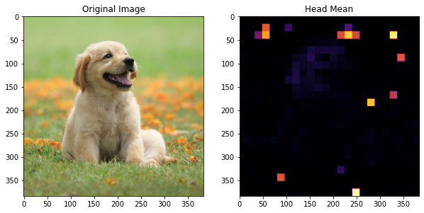
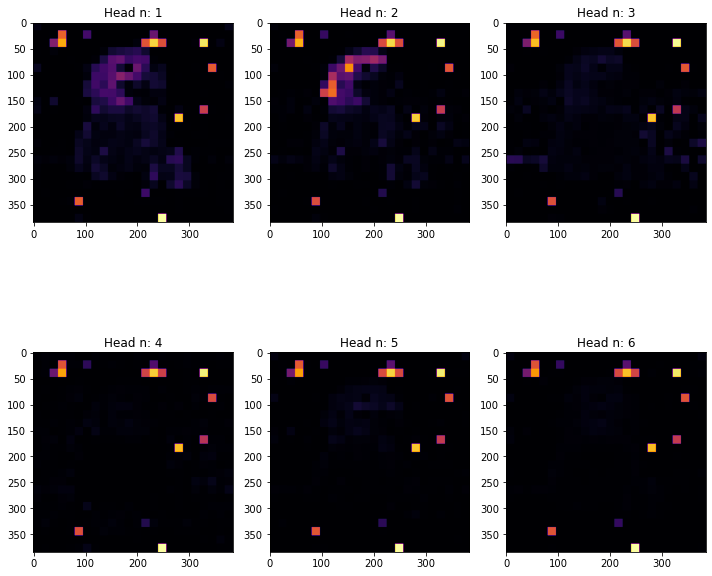
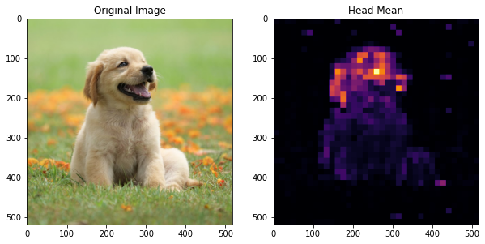
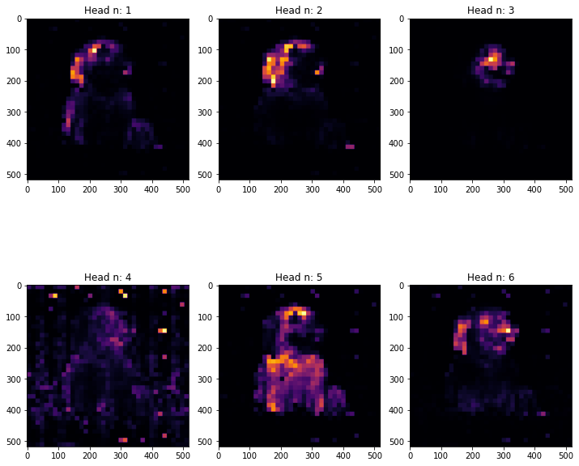

# timm vit visualization

- [timm](https://github.com/huggingface/pytorch-image-models)
- timm vision transformer: [VisionTransformer](https://github.com/huggingface/pytorch-image-models/blob/main/timm/models/vision_transformer.py)
- use pytorch register_forward_hook

## vit_small_patch16_384

juypiter notebook: [vit_small_patch16_384.ipynb](vit_small_patch16_384.ipynb)

- patch_size: 16
- attention head: 6
- image_size: 384
- embed_dim: 384

## vit_small_patch14_dinov2

juypiter notebook: [vit_small_patch14_dinov2.ipynb](vit_small_patch14_dinov2.ipynb)

- patch_size: 14
- attention head: 6
- image_size: 518
- embed_dim: 384

# Reference

timm: https://github.com/huggingface/pytorch-image-models

imagenet 1000 class: https://gist.github.com/yrevar/942d3a0ac09ec9e5eb3a

ViT: https://openreview.net/forum?id=YicbFdNTTy

dinov2: https://github.com/facebookresearch/dinov2

visualization (plot_attention): https://mp.weixin.qq.com/s/lW20p0RnfyejqnNc4_vMBQ

json_dumps_util.py: https://gist.github.com/jannismain/e96666ca4f059c3e5bc28abb711b5c92
